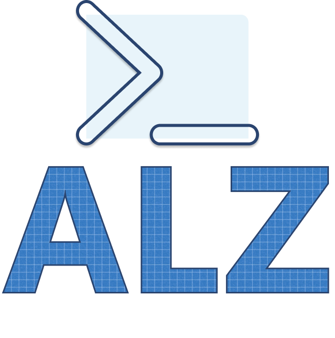

# ALZ

[](LICENSE)



## Synopsis

This is a PowerShell module that provides a set of cmdlets to create and manage Azure Landing Zones.

## Description

This module provides a set of cmdlets to create and manage Azure Landing Zones.

## Why

The goal of this project it is to make easy to get started with Azure Landing Zones and to speed up some basic tasks that you would need to perform whilst managing your Azure Landing Zones.

## Getting Started

### Prerequisites

In order to use this module you will need PowerShell 7.1 or higher.

### Installation

You can install this module using PowerShellGet.

```powershell
Install-Module -Name ALZ
```

### Quick start

Before you start you can utilize the functionality of the module to verify if you have all the prerequisites installed with the built in command:

```powershell
Test-ALZRequirement
```

Currently this tests for:

* Supported minimum PowerShell version
* Azure PowerShell Module
* Git
* Azure CLI
* Bicep

#### Create a new Azure Landing Zone Environment with GitHub Actions Workflows

```powershell
New-ALZEnvironment -o <output_directory>
```

#### Azure Landing Zone Environment with Azure DevOps Pipelines
```powershell
New-ALZEnvironment -o <output_directory> -cicd "azuredevops"
```
> **Note**
> Azure Devops Pipelines are only supported in v0.2.6 or later.

## Additonal Cmdlets

### Update an existing Azure Landing Zone Environment

#### Downloads and pulls down the specified release version from the remote GitHub repository to a local directory


```powershell
Get-ALZGithubRelease -githubRepoUrl "https://github.com/Azure/ALZ-Bicep" -releases "v0.14.0" -directoryForReleases "C:\Repos\ALZ\accelerator\upstream-releases\"
```

## Development

### Development Prerequisites

In order to develop this module you will need PowerShell 7.1 or later.

### Commands to install a build locally

```powershell
# Install the module locally
Invoke-Build -File .\src\ALZ.build.ps1
Import-Module .\src\Artifacts\ALZ.psd1 -Force
```

## Contributing

This project welcomes contributions and suggestions.  Most contributions require you to agree to a Contributor License Agreement (CLA) declaring that you have the right to, and actually do, grant us
the rights to use your contribution. For details, visit <https://cla.opensource.microsoft.com>.

When you submit a pull request, a CLA bot will automatically determine whether you need to provide a CLA and decorate the PR appropriately (e.g., status check, comment). Simply follow the instructions provided by the bot. You will only need to do this once across all repos using our CLA.

This project has adopted the [Microsoft Open Source Code of Conduct](https://opensource.microsoft.com/codeofconduct/).
For more information see the [Code of Conduct FAQ](https://opensource.microsoft.com/codeofconduct/faq/) or contact [opencode@microsoft.com](mailto:opencode@microsoft.com) with any additional questions or comments.

## Trademarks

This project may contain trademarks or logos for projects, products, or services. Authorized use of Microsoft trademarks or logos is subject to and must follow [Microsoft's Trademark & Brand Guidelines](https://www.microsoft.com/en-us/legal/intellectualproperty/trademarks/usage/general).
Use of Microsoft trademarks or logos in modified versions of this project must not cause confusion or imply Microsoft sponsorship.
Any use of third-party trademarks or logos are subject to those third-party's policies.
