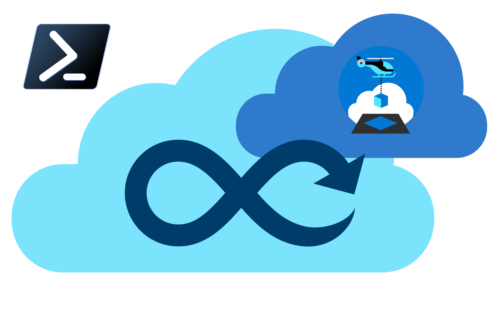

# Azure Landing Zones Accelerators for Bicep and Terraform

[](LICENSE)
[](https://scorecard.dev/viewer/?uri=github.com/Azure/ALZ-PowerShell-Module)




## Introduction

This repository contains the PowerShell module and documentation for the Azure landing zones Accelerators for Bicep and Terraform. The accelerators are an opinionated implementation of the Azure Landing Zones modules, with Azure DevOps or GitHub bootstrapping.

## Supported Infrastructure as Code (IaC) Types

The accelerators support multiple Infrastructure as Code approaches:

- **terraform**: Terraform-based Azure Landing Zones
- **bicep**: Bicep-based Azure Landing Zones using the traditional [ALZ-Bicep](https://github.com/Azure/ALZ-Bicep) framework
- **bicep-avm**: Bicep-based Azure Landing Zones using the new [alz-bicep-accelerator](https://github.com/Azure/alz-bicep-accelerator) framework built on Azure Verified Modules

It is designed to be used as a template to enable you to get started quickly deploying ALZ with any of these approaches.

Please refer to our [Docs](https://aka.ms/alz/acc) for detailed features and usage instructions.

## Quick Start

To get going right now, run these PowerShell steps:

```pwsh
Install-Module -Name ALZ
Deploy-Accelerator -inputs "inputs.yaml"
```

## Software Requirements

You can see the software requirements for the ALZ Accelerators in the [Phase 1 Docs](https://aka.ms/alz/acc/phase1).

To check the requirements, run these commands:

```pwsh
Install-Module -Name ALZ
Test-AcceleratorRequirements
```

## Contributing

This project welcomes contributions and suggestions.  Most contributions require you to agree to a
Contributor License Agreement (CLA) declaring that you have the right to, and actually do, grant us
the rights to use your contribution. For details, visit [https://cla.opensource.microsoft.com](https://cla.opensource.microsoft.com).

When you submit a pull request, a CLA bot will automatically determine whether you need to provide
a CLA and decorate the PR appropriately (e.g., status check, comment). Simply follow the instructions
provided by the bot. You will only need to do this once across all repos using our CLA.

This project has adopted the [Microsoft Open Source Code of Conduct](https://opensource.microsoft.com/codeofconduct/).
For more information see the [Code of Conduct FAQ](https://opensource.microsoft.com/codeofconduct/faq/) or
contact [opencode@microsoft.com](mailto:opencode@microsoft.com) with any additional questions or comments.

## Trademarks

This project may contain trademarks or logos for projects, products, or services. Authorized use of Microsoft
trademarks or logos is subject to and must follow
[Microsoft's Trademark & Brand Guidelines](https://www.microsoft.com/legal/intellectualproperty/trademarks/usage/general).
Use of Microsoft trademarks or logos in modified versions of this project must not cause confusion or imply Microsoft sponsorship.
Any use of third-party trademarks or logos are subject to those third-party's policies.
