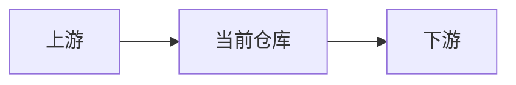
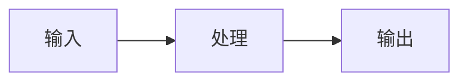

# Repo 解析模板（通用）

用于“一次只学一个仓库”的标准化解析。

## 1. 仓库定位

- 一句话定位：
- 这个仓库解决什么问题：
- 这个仓库不解决什么问题：

## 2. 与 ALZ 生态关系

- 上游依赖仓库：
- 下游承接仓库：
- 与 Terraform/Bicep 路线关系：

## 3. 输入 -> 处理 -> 输出

- 输入：
- 处理：
- 输出：

## 4. 60-90 分钟学习步骤

1. 看 README 与 docs 导航（15 分钟）
2. 看目录与入口（20 分钟）
3. 追一条端到端路径（20-30 分钟）
4. 写总结与风险点（10-20 分钟）

## 5. 常见坑位

- 坑位 1：
- 坑位 2：
- 坑位 3：

## 6. 自测题

- 题 1：
- 题 2：
- 题 3：

通过标准：3 题都能不看笔记回答。

## 7. 私有仓库占位说明（如适用）

- 预计职责：
- 待权限后验证项：
- 公开替代学习路径：

## 8. 下一站

- 推荐下一个仓库：
- 推荐原因：
