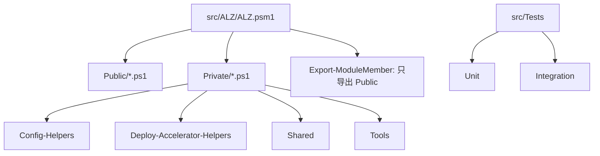
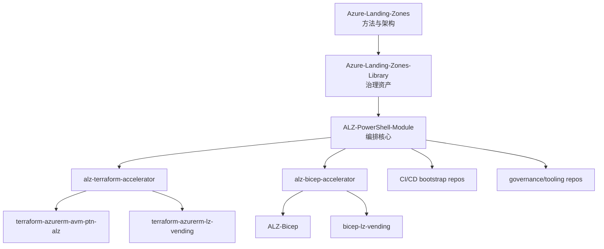
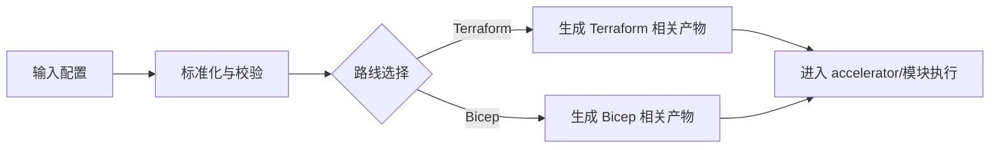

# 03 - ALZ-PowerShell-Module 学习解析

仓库地址：<https://github.com/Azure/ALZ-PowerShell-Module>

## 1. Repo Positioning

ALZ-PowerShell-Module 是 ALZ 生态里的编排入口，负责把配置、治理资产、IaC 路线（Terraform/Bicep）和 bootstrap 流程串成可执行路径。

为什么现在学：
- 在 mixed 路线里，它是 Terraform 与 Bicep 的共同交汇点。
- 先理解这里，后续学 accelerator 与实现模块会快很多。

它不是什么：
- 它不是某一个单独平台模块（比如仅网络或仅订阅 vending）。

## 1.1 结构解读（你最该先看懂的）

这个仓库在 `src/ALZ` 下的结构可以直接理解成四层：

- `Public/`：对外命令层（你平时直接调用的命令）。
    - 例如：`Deploy-Accelerator.ps1`、`Test-AcceleratorRequirement.ps1`、`New-AcceleratorFolderStructure.ps1`。
- `Private/`：内部实现层（真正复杂逻辑都在这里）。
    - `Config-Helpers/`：配置读取、转换、计算与写出（含 tfvars/json 产物生成）。
    - `Deploy-Accelerator-Helpers/`：部署流程编排、bootstrap、terraform 调用与场景选择。
    - `Shared/`：跨功能共享函数。
    - `Tools/`：工具辅助能力。
- `ALZ.psm1`：装载器。会递归加载 `Public` 和 `Private` 全部 `.ps1`，然后只导出 `Public` 函数。
- `src/Tests`：测试层（`Unit/` + `Integration/`）。

最关键的一点：
- 你在 `Public` 看到的是入口；
- 真正决定行为的是 `Private` 下的 helpers；
- `ALZ.psm1` 决定了“内部全加载、对外只暴露 Public”的模块边界。

结构图：

## 2. Relationship Diagram

## 3. Inputs, Process, Outputs

### Inputs
- 用户输入配置（例如 inputs 文件与参数）
- 治理资产与默认配置（来自 ALZ library/相关配置）
- 目标路线选择（terraform、bicep、bicep-classic）

### Process
- 读取并标准化输入配置
- 选择路径并调用对应 helper（配置转换、模板/变量生成、流程编排）
- 触发后续 accelerator 或 IaC 执行链

关键实现点（来自实际文件名）：
- 配置转换：`Convert-HCLVariablesToInputConfig.ps1`、`Convert-BicepConfigToInputConfig.ps1`。
- 配置计算：`Set-ComputedConfiguration.ps1`、`Set-Config.ps1`。
- 产物写出：`Write-TfvarsJsonFile.ps1`、`Write-JsonFile.ps1`。
- Terraform 执行：`Invoke-Terraform.ps1`。
- 场景来源：`TerraformScenarios.json`。

### Outputs
- 标准化配置结果与中间产物
- Terraform/Bicep 路线所需文件或执行上下文
- 可继续进入 bootstrap、deploy、test 的可执行状态

流程视图：

## 4. 60-90 Minute Study Plan

1. 读 README 和 docs 导航（15 分钟）
- 目标：确认模块定位、支持路线、核心命令。

2. 看目录和入口（20 分钟）
- 重点：`src/ALZ/Public`、`src/ALZ/Private`、`src/Tests`。
- 输出：找出 1 个 public 入口 + 3 个 private helper。

3. 追 1 条端到端路径（20-30 分钟）
- 推荐从 `Deploy-Accelerator` 入口追踪。
- 输出：画出“入口 -> helper -> 产物/下游”的调用链。

4. 写总结与风险点（10-20 分钟）
- 输出：3 个高风险变更点 + 2 条测试建议。

## 5. Common Pitfalls

- 只看 public 函数，不追 private helper，导致看不懂真实执行链。
- 不先确认 IaC 路线就分析细节，容易把 Terraform/Bicep 逻辑混在一起。
- 改动配置转换逻辑时不做回归测试，容易连锁影响多条路径。
- 把它当成最终 IaC 模块仓库，而不是编排入口。

## 5.1 这仓库你可以这样记

- `ALZ-PowerShell-Module` = 调度中枢（orchestrator）。
- `alz-terraform-accelerator` = Terraform 起步骨架（starter/template）。
- `terraform-azurerm-avm-ptn-*` = 真正实施模块（资源落地层）。

## 6. Self-Check

- 你能否解释 ALZ-PowerShell-Module 与 alz-terraform-accelerator 的边界？
- 你能否口头复述 1 条从输入到 Terraform 产物的路径？
- 你能否指出 2 个改动后必须补测的关键点？

Pass rule：3 题都能不看文档回答。

## 7. Private/Inaccessible Placeholder

如果遇到私有仓库或无权限仓库：
- 占位说明：记录该仓库预计职责、与当前仓库的接口边界、待验证问题。
- 替代路径：优先在公开仓库中寻找同类流程（accelerator、AVM pattern、sample repo）进行对照学习。
- 回填规则：拿到权限后补齐“真实入口、关键流程、风险点”三项。

## 8. Next Repo

推荐下一站：`alz-terraform-accelerator`

原因：
- 你已掌握编排入口，下一步最自然是看 Terraform 加速器如何承接并落地执行。
- 这会直接连接到 `terraform-azurerm-avm-ptn-alz` 等实施仓库。

下一站聚焦：
- 输入约定
- 模块调用关系
- 与 CI/CD bootstrap 的衔接点
