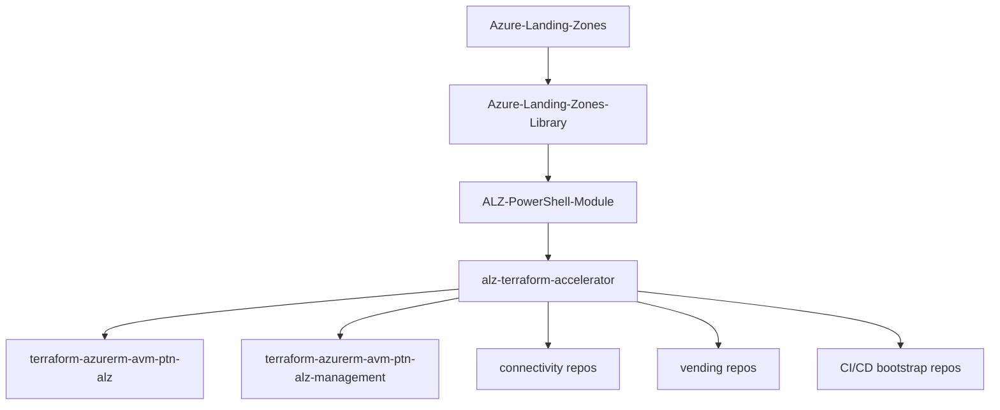

# 04 - alz-terraform-accelerator 解析文档

仓库地址：<https://github.com/Azure/alz-terraform-accelerator>

## 1. 仓库定位

`alz-terraform-accelerator` 是 Terraform 路线的加速器仓库，提供 ALZ Terraform 的 starter modules 与可复用模板骨架，承接编排层并连接到 AVM/pattern 实施模块。

它解决的问题：
- 给 Terraform 路线提供可起步、可扩展的模块化入口。
- 帮助团队更快组织 landing zone 交付结构。

它不直接替代：
- `ALZ-PowerShell-Module` 的编排角色。
- 各个 AVM/pattern repo 的具体实现职责。

## 1.1 结构解读（直接看懂仓库）

这个仓库最有价值的是 `templates/`，可以理解成三层：

- `templates/.config/ALZ-Powershell.config.json`
  - 定义模板在 ALZ 编排中的“可发现配置”，告诉编排层有哪些可用模板（例如 `platform_landing_zone`、`empty`）。
- `templates/platform_landing_zone/`
  - 主模板（生产路径最核心）。
  - `main.config.tf`：把输入变量喂给 config-templating 子模块。
  - `main.management.groups.tf`：调用 `Azure/avm-ptn-alz/azurerm`。
  - `main.management.resources.tf`：调用 `Azure/avm-ptn-alz-management/azurerm`。
  - `main.connectivity.hub.and.spoke.virtual.network.tf`：调用 hub-and-spoke 连接模块。
  - `main.connectivity.virtual.wan.tf`：调用 virtual wan 连接模块。
  - `variables.connectivity.tf`：`connectivity_type` 路由开关（`hub_and_spoke_vnet` / `virtual_wan` / `none`）。
- `templates/platform_landing_zone/modules/config-templating/`
  - 配置模板渲染层，负责把 starter 输入转换为可落地的结构化输出。

另外：
- `templates/platform_landing_zone/examples/bootstrap/inputs-*.yaml` 给出本地、GitHub、Azure DevOps 三类引导输入样例。
- `templates/test/` 是测试模板。

## 2. 与 ALZ 生态关系

关系要点：
- 上游：架构与治理（ALZ + Library）和编排入口（PowerShell Module）。
- 下游：具体 Terraform 模块仓库与交付流水线仓库。

## 3. 输入 -> 处理 -> 输出

- 输入：目标落地场景、Terraform 路线配置、模块变量与模板参数。
- 处理：以 starter modules/templates 方式组织实现结构，连接下游 pattern modules。
- 输出：可执行的 Terraform 项目结构与落地路径。

真实调用链可以简化成：

1. 在 `ALZ-Powershell.config.json` 选中 `platform_landing_zone` 模板。
2. `main.config.tf` 把输入传给 `modules/config-templating`。
3. 根据 `connectivity_type` 选择 `hub_and_spoke_vnet` 或 `virtual_wan` 分支。
4. 管理组与管理资源分别交给 `avm-ptn-alz` 和 `avm-ptn-alz-management`。

## 4. 60-90 分钟学习步骤

1. README 快速读（15 分钟）
- 目标：确认仓库定位是 starter modules。
- 记录关键词：accelerator、templates、starter modules。

2. 目录与入口（20 分钟）
- 重点看：`templates/`、`docs/wiki/`、`DEVELOPER.md`。
- 输出：每个目录一句话职责。

3. 一条端到端路径（25-30 分钟）
- 从模板入口追到一个具体下游模块引用。
- 记录：输入变量 -> 模板/模块组织 -> 下游实现。

4. 复盘总结（10-20 分钟）
- 输出 3 个结论：
  - 它如何加速 Terraform 起步
  - 它与 ALZ-PowerShell-Module 的边界
  - 变更它时最可能影响哪里

## 5. 常见坑位

- 把 accelerator 当作“全部实现代码”，忽略下游 AVM/pattern repo。
- 只看 README，不看 `templates/`，无法理解真实承接结构。
- 未区分“模板骨架变更”与“下游模块变更”的影响范围。

再补两个高频坑：
- 忽略 `variables.moved.tf` / `outputs.moved.tf` 的迁移语义，升级时容易误判兼容性。
- 看到 `examples` 就当最终生产配置直接复制，未结合自身订阅/治理约束做裁剪。

## 6. 自测题

- 你能否解释它与 `ALZ-PowerShell-Module` 的职责边界？
- 你能否说清它为什么需要下游 AVM/pattern 仓库配合？
- 你能否列出改动 `templates/` 后需要优先验证的 2 个方向？

通过标准：3 题均可不看笔记回答。

## 7. 私有/无权限占位说明

当前仓库为公开仓库；若后续遇到私有依赖仓库：
- 占位记录：预计接口、预期输入输出、待验证点。
- 替代学习：先通过公开下游模块仓库验证数据流与结构假设。

## 8. 下一站建议

下一仓库：`terraform-azurerm-avm-ptn-alz`

原因：
- 你已理解 accelerator 的承接层，下一步要进入核心实施层，看到真正的资源与模块实现语义。

一句话总结：
- 这个仓库是“装配线”，不是“全部零件”；零件主要在 `terraform-azurerm-avm-ptn-*` 系列仓库。
