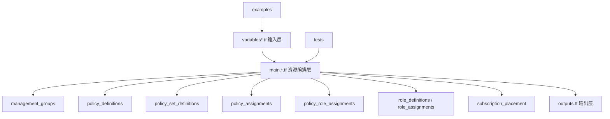
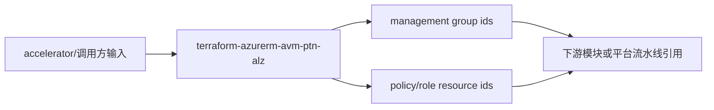

# 05 - terraform-azurerm-avm-ptn-alz 解析文档

仓库地址：<https://github.com/Azure/terraform-azurerm-avm-ptn-alz>

## 1. 仓库定位（直接结论）

`terraform-azurerm-avm-ptn-alz` 是 Terraform 路线里“ALZ 核心治理实施模块”。

它负责真正把 ALZ 架构落地为 Azure 管理平面资源：
- 管理组层级
- Policy 定义 / Policy Set / Assignment
- Policy 关联角色分配
- 自定义角色定义
- 订阅挂载到管理组

你可以把它看作：
- 04 (`alz-terraform-accelerator`) 是装配线
- 05 (`terraform-azurerm-avm-ptn-alz`) 是核心零件工厂

## 2. 结构解读（最重要）

从仓库根目录看，关键是这批分层文件：

- `main.management_groups.tf`
  - 管理组层级创建主逻辑。
- `main.policy_definitions.tf`
  - Policy Definitions 创建逻辑。
- `main.policy_set_definitions.tf`
  - Initiative/Policy Set 创建逻辑。
- `main.policy_assignments.tf`
  - Policy Assignment 创建和可定制逻辑。
- `main.policy_role_assignments.tf`
  - Policy assignment 需要的角色分配。
- `main.role_definitions.tf`
  - 自定义角色定义。
- `main.role_assignments.tf`
  - 管理组级角色分配。
- `main.subscription_placement.tf`
  - 订阅挂载（placement）到管理组。
- `main.hierarchy_settings.tf`
  - 管理组 hierarchy settings。
- `variables.tf` + `variables.role_assignments.tf` + `variables.telemetry.tf`
  - 输入契约定义。
- `outputs.tf`
  - 对外输出资源 ID 映射。
- `terraform.tf`
  - Provider 与版本要求。
- `terraform.tofu`
  - OpenTofu 兼容文件（实验性支持）。
- `examples/`
  - 使用样例。
- `tests/`
  - 验证与回归测试路径。

结构图：

## 3. 关键实现语义（你真正要记住的）

### 3.1 Provider 选择与行为

该模块重度依赖：
- `alz` provider
- `azapi` provider

设计目标是提高 ARM 控制面资源操作的稳定性与速度。

### 3.2 Unknown Values 与 depends_on 限制

README 明确说明：
- 由于 `alz` provider 的数据源读取时机，模块级 `depends_on` 不支持。
- 解决方式是使用 `_dependencies` 输入变量：
  - `management_groups_dependencies`
  - `policy_assignments_dependencies`
  - `policy_role_assignments_dependencies`

这点是你排障时第一优先检查项。

### 3.3 policy assignment 深度定制能力

`policy_assignments_to_modify` 支持细粒度改写：
- enforcement_mode
- identity / identity_ids
- non_compliance_messages
- parameters（JSON string 形式）
- resource_selectors
- overrides
- creation_enabled

这意味着它不是“只会按默认 ALZ 下发”，而是支持策略层面的定制覆写。

### 3.4 resource_types 兼容开关

`resource_types` 允许覆盖 AzAPI 资源类型字符串（含 API version 与大小写路径）。

适用场景：
- Sovereign Cloud API 版本差异
- AzAPI 大小写不一致导致的 forced replace 或读取不一致

### 3.5 订阅挂载销毁行为可控

`subscription_placement_destroy_behavior` 支持：
- `default`
- `parent`
- `intermediate_root`
- `custom`

这会直接影响 destroy 阶段的订阅归位行为。

## 4. 输入与输出（接口视角）

### 必填输入

- `architecture_name`
- `location`
- `parent_resource_id`

### 高价值可选输入

- `policy_assignments_to_modify`
- `policy_default_values`
- `management_group_role_assignments`
- `resource_types`
- `retries`
- `timeouts`
- `subscription_placement`
- `subscription_placement_destroy_behavior`
- `role_assignment_name_use_random_uuid`

### 关键输出

- `management_group_resource_ids`
- `policy_assignment_identity_ids`
- `policy_assignment_resource_ids`
- `policy_definition_resource_ids`
- `policy_set_definition_resource_ids`
- `policy_role_assignment_resource_ids`
- `role_definition_resource_ids`

调用链图：

## 5. 与 03/04 的边界关系

- 与 03 (`ALZ-PowerShell-Module`)：
  - 03 负责编排与入口体验；05 负责核心治理资源落地。
- 与 04 (`alz-terraform-accelerator`)：
  - 04 负责模板与组合；05 是被 04 组合调用的核心实施模块之一。

## 6. 高风险点（改动时先看）

- `_dependencies` 配置不当导致时序错乱（计划期/应用期行为不一致）。
- `policy_assignments_to_modify` 参数 JSON 结构错误导致 assignment 失败。
- `resource_types` 覆盖不当引入兼容性问题。
- `subscription_placement_destroy_behavior` 选错导致销毁后订阅归位异常。
- 关闭 `role_assignment_definition_lookup_enabled` 后却仍传 role 名称（非 ID）导致失败。

## 7. 私有/无权限占位说明

当前仓库为公开仓库。若你的企业扩展层是私有仓库：
- 占位记录：自定义 policy/archetype 来源、变量覆写入口、权限边界。
- 替代路径：先用 `examples/` + 上游 accelerator 路径验证接口，再回填私有实现差异。

## 8. 一句话记忆

这个仓库是 ALZ Terraform 路线“治理控制面的核心引擎”，不是样例模板仓库。

## 9. 下一站建议

下一仓库：`terraform-azurerm-avm-ptn-alz-management`

原因：
- 你已经理解核心治理引擎，下一步看 management 平面的资源实施细节，会把治理与平台运维层接起来。
