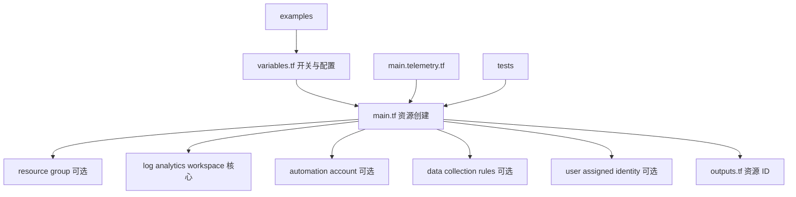
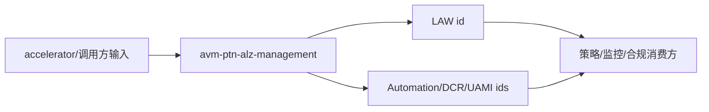
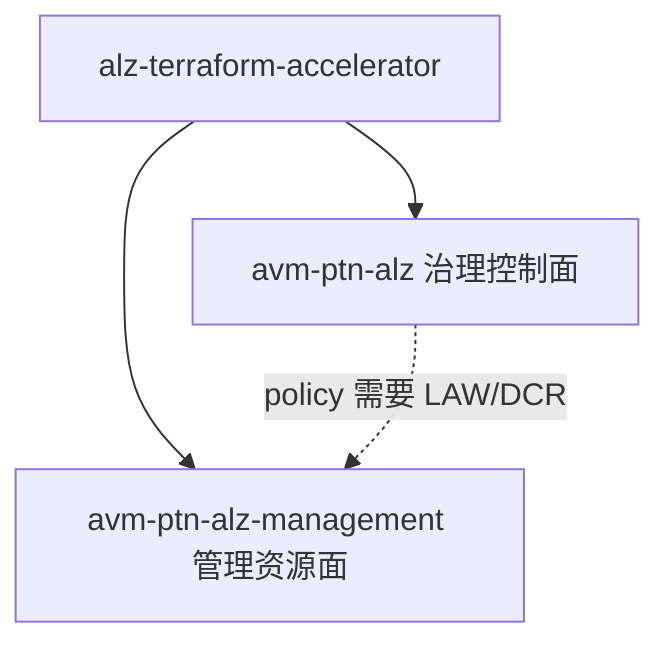

# 06 - terraform-azurerm-avm-ptn-alz-management 解析文档

仓库地址：<https://github.com/Azure/terraform-azurerm-avm-ptn-alz-management>

## 1. 仓库定位（直接结论）

`terraform-azurerm-avm-ptn-alz-management` 是 ALZ 的“管理平面资源实施模块”。

它专注部署 ALZ 平台运维/监控所需的基础资源：
- Log Analytics Workspace（核心）
- Automation Account（可选）
- Resource Group（可选）
- Log Analytics Solutions（可定制）
- Data Collection Rules（可选）
- User Assigned Managed Identity（可选）

一句话：05 负责“治理控制面”（管理组+策略），06 负责“管理资源面”（日志、监控、自动化）。

## 2. 与 05 的关键区别（最容易混）

| 维度 | 05 avm-ptn-alz | 06 avm-ptn-alz-management |
|---|---|---|
| 解决问题 | 管理组层级 + Policy + 角色 | 监控/日志/自动化等管理资源 |
| Provider 主力 | `alz` + `azapi` | `azurerm` + `azapi`（部分资源） |
| 输出核心 | management group / policy ids | LAW / Automation / DCR / UAMI ids |
| 在架构中的角色 | 治理控制面引擎 | 平台运维资源底座 |

## 3. 结构解读（真实文件）

这个仓库是标准 AVM 模块布局：

- `main.tf`
  - 核心资源：resource group、log analytics workspace、automation account 等（用 `count` 控制开关）。
- `main.telemetry.tf`
  - AVM 强制的 `modtm` 遥测块（不要手改，由 mapotf 维护）。
- `data.tf`
  - `azapi_client_config` 等数据源。
- `variables.tf`
  - 输入契约（大量 `*_creation_enabled` 开关 + LAW/AA 细粒度配置）。
- `outputs.tf`
  - 输出资源 ID（LAW、AA、DCR、UAMI、RG）。
- `terraform.tf`
  - Provider 与版本约束（azapi、azurerm、modtm、random）。
- `_header.md` / `_footer.md`
  - README 来源；改文档只改这里，不改 `README.md`。
- `examples/`
  - `default`、`complete`、`bring_your_own_law` 三类典型场景。
- `tests/`
  - `examples.tftest.hcl`（plan 级测试）、unit/integration。

结构图：

## 4. 关键设计点（你真正要记住的）

### 4.1 一切皆可选开关

模块通过 `*_creation_enabled` 系列变量控制是否创建：
- `resource_group_creation_enabled`
- `log_analytics_workspace_creation_enabled`
- 等等

这让它能适配 “全新部署” 和 “BYO 既有资源” 两种模式。

### 4.2 BYO（Bring Your Own）能力

`bring_your_own_law` example 展示：
- 关闭 LAW 创建（`log_analytics_workspace_creation_enabled = false`）
- 传入既有 `log_analytics_workspace_id`

这是企业接管存量资源的关键路径。

### 4.3 Provider 选择不同于 05

- 这里大量资源用 `azurerm`（LAW、Automation、Solution、Linked Service）。
- 少量用 `azapi`（data collection rule、sentinel onboarding）。
- 与 05 重度依赖 `alz` provider 形成明显对比。

### 4.4 文档与遥测是受管文件

- `README.md` 自动生成，改 `_header.md`。
- `main.telemetry.tf` 与 `terraform.tf` 的 provider 版本受治理工具控制，别手改。

## 5. 输入与输出（接口视角）

### 必填输入（default example）

- `automation_account_name`
- `location`
- `resource_group_name`
- `log_analytics_workspace_name`

### 高价值可选输入

- `log_analytics_workspace_creation_enabled` / `log_analytics_workspace_id`
- `resource_group_creation_enabled`
- `data_collection_rules`
- `user_assigned_managed_identities`
- `automation_account_identity` / `automation_account_sku_name`

### 关键输出

- `*_log_analytics_workspace_resource_id`
- `*_automation_account_resource_id`
- `*_data_collection_rule_ids`
- `*_managed_identity_ids`
- `*_resource_group_resource_id`

调用链图：

## 6. 它在整体链路里的位置

要点：
- 04 accelerator 同时调用 05 和 06。
- 05 的部分策略（如监控类）依赖 06 产出的 LAW/DCR 资源 ID。

## 7. 高风险点（改动时先看）

- BYO 场景下 `*_creation_enabled` 与 `*_id` 配对错误（既想创建又传既有 ID）。
- 手改了 `README.md` / `main.telemetry.tf` / `terraform.tf` 版本（会被生成流程覆盖或违反 AVM 规则）。
- Automation Account identity 配置与既有 UAMI 不匹配。
- DCR 配置变更未验证幂等，导致每次 plan 都漂移。

## 8. 修 bug 后怎么测（结合本仓库实际）

- 静态：`terraform fmt` / `init` / `validate`。
- 计划级测试：仓库自带 `tests/examples.tftest.hcl`（对 default 和 complete 做 `plan`）。
- 真机示例：进入 `examples/default` 或 `examples/complete` 跑 init/plan/apply，再 plan 做幂等检查。
- AVM 流程：`PORCH_NO_TUI=1 ./avm pre-commit`（或 Windows 用 `avm.ps1`）。
- 文档：只改 `_header.md`，不要动 `README.md`。

## 9. 一句话记忆

这个仓库是 ALZ 的“平台管理资源底座”，给治理与监控提供 LAW/Automation/DCR/UAMI 等可被引用的基础设施。

## 10. 下一站建议

下一仓库：`terraform-azurerm-avm-ptn-alz-connectivity-hub-and-spoke-vnet`

原因：
- 你已经看过治理面（05）和管理面（06），下一步进入网络连接面，把 ALZ 平台三大支柱补齐。
