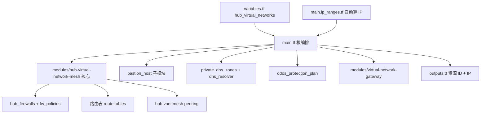
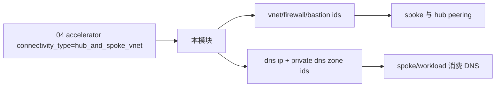

# 07 - terraform-azurerm-avm-ptn-alz-connectivity-hub-and-spoke-vnet 解析文档

仓库地址：<https://github.com/Azure/terraform-azurerm-avm-ptn-alz-connectivity-hub-and-spoke-vnet>

## 1. 仓库定位（直接结论）

这是 ALZ 的“网络连接面实施模块”，采用 **Hub & Spoke（中心-辐射）** 拓扑。

它把一整套连接性资源打包成一个 pattern 模块：
- Hub 虚拟网络（可多 Hub、可多区域、可 Mesh 互联）
- Azure Firewall + Firewall Policy
- Azure Bastion
- Virtual Network Gateway（VPN / ExpressRoute）
- NAT Gateway
- Private DNS Zones + Private DNS Resolver
- DDoS Protection Plan
- 路由表（firewall / gateway / user subnet）

一句话：05 治理面、06 管理面、07 连接面 —— 这是 ALZ 平台三大支柱的最后一块。

## 2. 它和前几个仓库的关系

| 模块 | 支柱 | Provider 主力 | 在 04 accelerator 里的调用点 |
|---|---|---|---|
| 05 avm-ptn-alz | 治理 | alz + azapi | main.management.groups.tf |
| 06 avm-ptn-alz-management | 管理 | azurerm + azapi | main.management.resources.tf |
| 07 本仓库 | 连接 | azurerm + 大量子模块 | main.connectivity.*.tf（connectivity_type = hub_and_spoke_vnet 时） |

注意：04 accelerator 的 `connectivity_type` 开关决定调用谁：
- `hub_and_spoke_vnet` → 调用本仓库
- `virtual_wan` → 调用 vWAN 版连接模块
- `none` → 不部署连接资源

## 3. 结构解读（真实文件）

这是一个“**外层薄编排 + 内层 mesh 子模块 + 大量 AVM 资源模块**”的三层结构。

### 3.1 根模块（编排层）

- `main.tf`
  - 调用一堆 AVM 资源模块：`bastion_host`（avm-res-network-bastionhost）、`bastion_public_ip`、`ddos_protection_plan`、`private_dns_zones`、`dns_resolver` 等。
- `main.ip_ranges.tf`
  - 自动计算地址空间。默认 hub `/16`（`10.{index}.0.0/16`），并为子网分配默认前缀：bastion `/26`、firewall `/26`、firewall_management `/26`、gateway `/27`、dns_resolver `/28`。用 `Azure/avm-utl-network-ip-addresses` 工具模块自动切分。
- `variables.tf`
  - 核心输入 `hub_virtual_networks`（map，每个 hub 一套配置）+ `hub_and_spoke_networks_settings` + `default_naming_convention`。
- `outputs.tf`
  - 暴露 firewall/bastion/dns/nat/vnet 等所有资源 ID 和关键 IP。
- `terraform.tf` / `main.telemetry.tf`
  - Provider 约束 + AVM 遥测块。

### 3.2 内部 mesh 子模块（核心）

- `modules/hub-virtual-network-mesh/`
  - 这是真正干活的核心：创建多个 hub vnet 并在它们之间做 **mesh peering**（`mesh_peering_enabled` 默认 true）。
  - 内部再调用：`hub_firewalls`、`fw_policies`、`fw_default_ips`、`hub_routing_firewall`（路由表）、`hub_virtual_network_peering` 等。
  - 输出 `firewalls`、`firewall_policies`、`hub_route_tables_firewall` 等被根模块二次封装。

### 3.3 其它子模块

- `modules/virtual-network-gateway/`
  - 即 `avm-ptn-vnetgateway`，部署 VPN/ExpressRoute 网关及附属资源。

结构图：



## 4. 关键设计点（你真正要记住的）

### 4.1 一切以 `hub_virtual_networks` map 驱动

输入是一个 map，key 是 hub 名（如 primary/secondary），每个 value 里用嵌套对象配置该 hub 的所有资源。多区域 = 多个 key。

### 4.2 `enabled_resources` 细粒度开关

每个 hub 内部用 `enabled_resources` 决定部署哪些组件：
```hcl
enabled_resources = {
  firewall                              = true/false
  bastion                               = true/false
  private_dns_zones                     = true/false
  private_dns_resolver                  = true/false
  virtual_network_gateway_vpn           = true/false
  virtual_network_gateway_express_route = true/false
  nat_gateway                           = true/false
}
```
这是你看 examples 时最该关注的部分——不同 example 就是开关组合不同。

### 4.3 它本身不是写资源，而是“编排 AVM 资源模块”

作为 pattern 模块，它几乎不直接写 `azurerm_*` 资源，而是大量 `module "..."` 调用官方 AVM 资源模块（bastionhost、firewall、routetable、privatednszone、dnsresolver、ddosprotectionplan、publicipaddress…）。这是 AVM pattern 模块的典型特征。

### 4.4 自动 IP 规划

不传 `default_hub_address_space` 时，它自动按 hub 顺序分配 `/16`，并自动切分各子网。要自定义就显式传地址空间。

### 4.5 多 Hub Mesh

`mesh_peering_enabled = true`（默认）会把多个 hub 互相 peering，构成多区域互联骨干。单区域可关掉。

## 5. 典型 examples（学习路径）

按从简到繁推荐：
- `minimal-config`：最小双 hub，几乎全默认。
- `firewall-basic-sku`：加防火墙（Basic SKU）。
- `basic-options-and-single-region`：单区域 + 自定义命名/地址。
- `firewall-with-nat-gatewayv2` / `nva-nat-gatewayv2`：防火墙或 NVA + NAT 网关。
- `firewall-policy-alternative-region`：跨区域防火墙策略继承（base_policy_id）。
- `full-multi-region`：完整多区域，配合 `config` 模块生成输入。

所有 example 都是独立 root module，统一用 `random_string.suffix` 防重名，先建 RG（`avm-res-resources-resourcegroup`）再调本模块。

## 6. 输入与输出（接口视角）

### 关键输入

- `hub_virtual_networks`（核心 map，必填实际内容）
- `hub_and_spoke_networks_settings`（全局连接设置，如 ddos 开关）
- `default_naming_convention`（命名模板，支持 `${location}`/`${sequence}` 占位）
- `enable_telemetry` / `tags`

### 关键输出

- `firewall_private_ip_addresses` / `firewall_public_ip_addresses` / `firewall_resource_ids`
- `bastion_host_*`
- `dns_resolver_*` / `private_dns_zone_resource_ids` / `dns_server_ip_addresses`
- `nat_gateway_resource_ids`
- `resource_id`（各 hub vnet 的 id）/ `route_tables_*`

调用链图：



## 7. 高风险点（改动时先看）

- 地址空间冲突：自动 `/16` 与已有网络重叠；多 hub 时务必规划好或显式传地址。
- 子网前缀不够：firewall/gateway/bastion 子网有最小尺寸要求（见 main.ip_ranges.tf 默认值）。
- `enabled_resources` 与依赖资源不匹配（如关了 firewall 但路由仍指向防火墙）。
- mesh peering 在单区域误开，产生多余 peering。
- 防火墙策略 `base_policy_id` 跨区域继承时区域/SKU 不一致。
- 手改 `README.md` / `main.telemetry.tf`（生成/受管文件）。

## 8. 修 bug 后怎么测（结合本仓库实际）

- 静态：`terraform fmt` / `init` / `validate`。
- plan 级：进入某个 `examples/<name>` 跑 `terraform plan`（多数 example 无必填输入）。
- 真机：选 `minimal-config` 或 `firewall-basic-sku` 跑 init/plan/apply，再 plan 做幂等检查，最后 `destroy` 清理。
- AVM 流程：`PORCH_NO_TUI=1 ./avm pre-commit`（Windows 用 `avm.ps1`）。
- 注意：连接资源（防火墙、网关）部署慢且贵，测试优先用最小 example。

## 9. 一句话记忆

这个仓库是 ALZ 的“连接面编排器”，用一个 `hub_virtual_networks` map 把防火墙/Bastion/网关/DNS/NAT 等一整套 hub-spoke 网络资源（全部基于 AVM 资源模块）编排出来。

## 10. 下一站建议

可选两条路线：
- 网络面对照学：`terraform-azurerm-avm-ptn-alz-connectivity-virtual-wan`（vWAN 版连接，理解 `connectivity_type` 另一分支）。
- 回到顶层闭环：把 04 accelerator 的 `main.connectivity.*.tf` 再读一遍，串起 05/06/07 三支柱的完整装配。

推荐先看 vWAN 版，把“连接面”两种实现彻底对照清楚。
