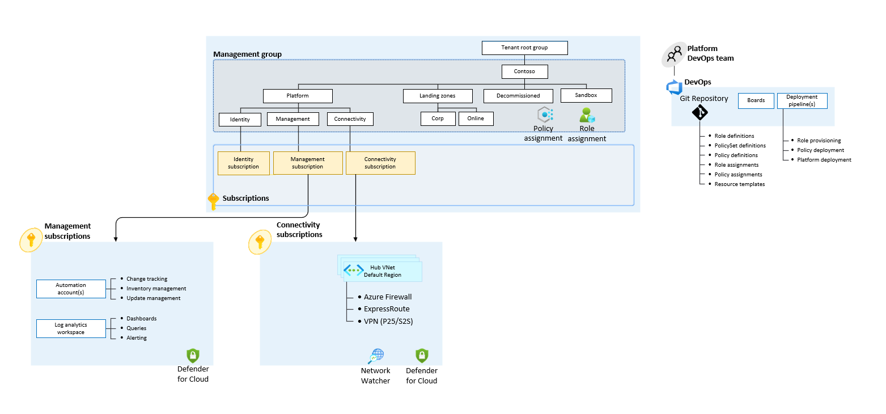

<!-- markdownlint-disable first-line-h1 -->
The `complete_multi_region` starter module provides full customization of the Azure Landing Zone using a YAML or JSON configuration file. The configuration file provides the ability to enable and disable modules, configure module inputs and outputs, and configure module resources. It is multi-regional by default and can support 1 or more regions.

A custom config file can be passed to the `configuration_file_path` argument of the ALZ PowerShell Module. This allows you to firstly design your Azure Landing Zone, and then deploy it. The config file can be in YAML or JSON format, our examples are all YAML.

If not specified, the default `config-hub-and-spoke-vnet-multi-region.yaml` file will be used, which can be seen [here][example_starter_module_complete_config_hub_spoke_multi_region].

The following table describes the inputs required for the `complete_multi_region` starter module.

| Input | Placeholder | Description |
| - | -- | --- |
| `configuration_file_path` | `<configuration-file-path>` | This is the absolute path to the configuration file. E.g. `c:\my-config\config.yaml` or `~/my-config/config.yaml`. For YAML on Windows you will need to escape the `\`, i.e. `c:\\my-config\\config.yaml`. |
| `default_postfix` | `<postfix>` | This is the default postfix used for resource names. |

Example input files can be found here:

- [inputs-azure-devops-terraform-complete-multi-region.yaml][example_powershell_inputs_azure_devops_terraform_complete_multi_region]
- [inputs-github-terraform-complete-multi-region.yaml][example_powershell_inputs_github_terraform_complete_multi_region]
- [inputs-local-terraform-complete-multi-region.yaml][example_powershell_inputs_local_terraform_complete_multi_region]

You can create a custom yaml config to tailor to your needs, for example an Azure Landing Zone with a three-region mesh. Get started with our samples:

- Multi region hub and spoke virtual network: [config-hub-and-spoke-vnet.yaml][example_starter_module_complete_config_hub_spoke_multi_region]
- Multi region virtual WAN: [config-virtual-wan.yaml][example_starter_module_complete_config_vwan_multi_region]
- Single region hub and spoke virtual network: [config-hub-and-spoke-vnet-single-region.yaml][example_starter_module_complete_config_hub_spoke_single_region]
- Single region virtual WAN: [config-virtual-wan-single-region.yaml][example_starter_module_complete_config_vwan_single_region]

## Further details on the Complete Multi Region Starter Module and config file

The example config files have helpful templated variables such as `starter_location_##` and `root_parent_management_group_id` which get prompted for during the ALZ PowerShell Module run. Alternatively, you can opt to not use the templated variables and hard-code the values in your config file.

> **Note:** We use the `caf-enterprise-scale` module for management groups and policies, and the Azure Verified Modules for connectivity resources.

### High Level Design

### Terraform Modules

The following modules are composed together in the `complete_multi_region` starter module.

#### `caf-enterprise-scale`

The `caf-enterprise-scale` module is used to deploy the management group hierarchy, policy assignments and management resources. For more information on the module itself see [here](https://github.com/Azure/terraform-azurerm-caf-enterprise-scale).

#### `avm-ptn-hubnetworking`

The `avm-ptn-hubnetworking` module is used to deploy connectivity resources such as Virtual Networks and Firewalls.
This module can be extended to deploy multiple Virtual Networks at scale, Route Tables, and Resource Locks. For more information on the module itself see [here](https://github.com/Azure/terraform-azurerm-avm-ptn-hu).

#### `avm-ptn-vnetgateway`

The `avm-ptn-vnetgateway` module is used to deploy a Virtual Network Gateway inside your Virtual Network. Further configuration can be added (depending on requirements) to deploy Local Network Gateways, configure Virtual Network Gateway Connections, deploy ExpressRoute Gateways, and more. Additional information on the module can be found [here](https://github.com/Azure/terraform-azurerm-avm-ptn-vnetgateway).

#### `avm-ptn-vwan`

The `avm-ptn-vwan` module is used to deploy a Virtual WAN. Further configuration can be added (depending on requirements) to deploy VPN Sites, configure VPN Connections, and more. Additional information on the module can be found [here](https://github.com/Azure/terraform-azurerm-avm-ptn-vwan).

#### `avm-ptn-network-private-link-private-dns-zones`

The `avm-ptn-network-private-link-private-dns-zones` module is used to deploy Private DNS Zones for Private Link Services. Further configuration can be added depending on requirements. Additional information on the module can be found [here](https://github.com/Azure/terraform-azurerm-avm-ptn-network-private-link-private-dns-zones).

 [//]: # (************************)
 [//]: # (INSERT LINK LABELS BELOW)
 [//]: # (************************)

[example_starter_module_complete_config_hub_spoke_single_region]: https://raw.githubusercontent.com/Azure/alz-terraform-accelerator/refs/heads/main/templates/complete_multi_region/config-hub-and-spoke-vnet-single-region.yaml "Example - Starter Module Config - Complete - Hub and Spoke VNet Single Region"
[example_starter_module_complete_config_vwan_single_region]: https://raw.githubusercontent.com/Azure/alz-terraform-accelerator/refs/heads/main/templates/complete_multi_region/config-virtual-wan-single-region.yaml "Example - Starter Module Config - Complete - Virtual WAN Single Region"
[example_starter_module_complete_config_hub_spoke_multi_region]: https://raw.githubusercontent.com/Azure/alz-terraform-accelerator/refs/heads/main/templates/complete_multi_region/config-hub-and-spoke-vnet-multi-region.yaml "Example - Starter Module Config - Complete - Hub and Spoke VNet Multi Region"
[example_starter_module_complete_config_vwan_multi_region]: https://raw.githubusercontent.com/Azure/alz-terraform-accelerator/refs/heads/main/templates/complete_multi_region/config-virtual-wan-multi-region.yaml "Example - Starter Module Config - Complete - Virtual WAN Multi Region"
[example_powershell_inputs_azure_devops_terraform_complete_multi_region]:     examples/powershell-inputs/inputs-azure-devops-terraform-complete-multi-region.yaml "Example - PowerShell Inputs - Azure DevOps - Terraform - Complete Multi Region"
[example_powershell_inputs_github_terraform_complete_multi_region]:     examples/powershell-inputs/inputs-github-terraform-complete-multi-region.yaml "Example - PowerShell Inputs - GitHub - Terraform - Complete Multi Region"
[example_powershell_inputs_local_terraform_complete_multi_region]:     examples/powershell-inputs/inputs-local-terraform-complete-multi-region.yaml "Example - PowerShell Inputs - Local - Terraform - Complete Multi Region"
