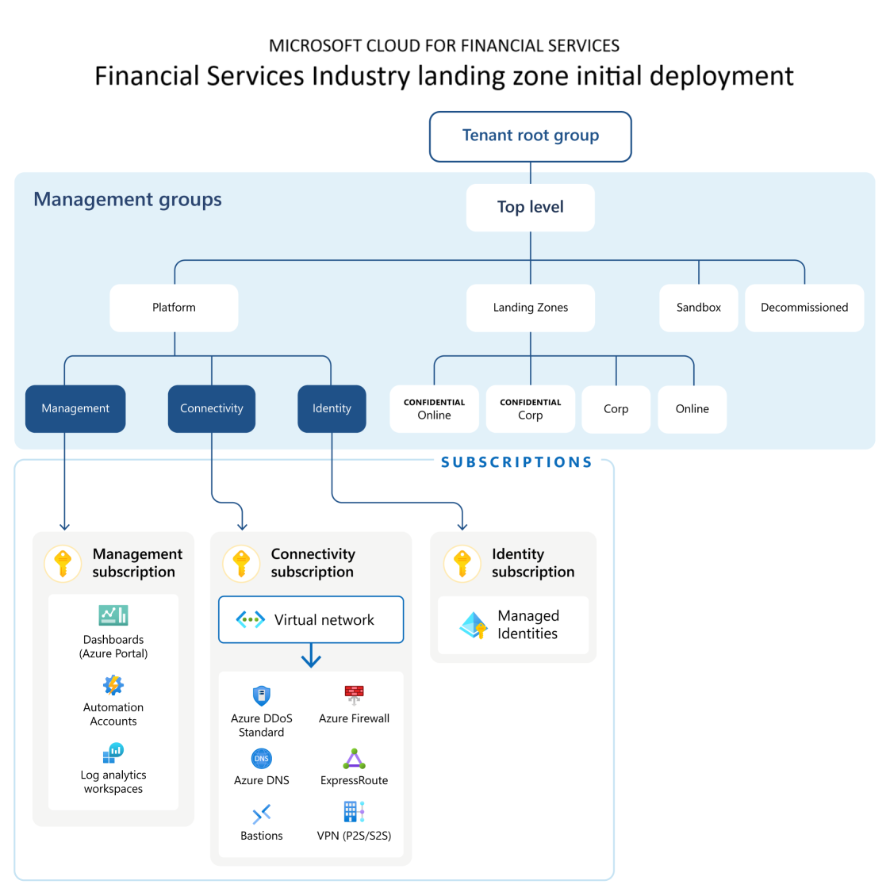

<!-- markdownlint-disable first-line-h1 -->
The `financial_services_landing_zone` starter module provides full customization of the Financial Services Industry Landing Zone (FSILZ) using the `inputs.yaml` file. The `inputs.yaml` file provides the ability to enable and disable modules, configure module inputs and outputs, and configure module resources.
A custom `inputs.yaml` file can be passed to the `inputs` argument of the ALZ PowerShell Module. This allows you to firstly design your Azure Landing Zone, and then deploy it.

The default `inputs.yaml` file will need to be modified based on the documentation below.

Example input files can be found here:

- [inputs-azure-devops-terraform-financial-services-landing-zone.yaml][example_powershell_inputs_azure_devops_terraform_financial_services_industry_landing_zone]
- [inputs-github-terraform-financial-services-landing-zone.yaml][example_powershell_inputs_github_terraform_financial_services_industry_landing_zone]
- [inputs-local-terraform-financial-services-landing-zone.yaml][example_powershell_inputs_local_terraform_financial_services_industry_landing_zone]

The following table describes the inputs for the `financial_services_landing_zone` starter module.

| Input | Required | Type | Default Value | Description |
| - | -- | --- | ---- | ----- |
| `allowed_locations` | Required | List |  | This is a list of Azure regions all workloads running outside of the Confidential Management Group scopes are allowed to be deployed into. |
| `allowed_locations_for_confidential_computing` | Required | List |  | This is a list of Azure regions all workloads running inside of the Confidential Management Group scopes are allowed to be deployed into. |
| `az_firewall_policies_enabled` |  | Boolean | `true` | Set to `true` to deploy a default Azure Firewall Policy resource if `enable_firewall` is also `true`. |
| `apply_alz_archetypes_via_architecture_definition_template` |  | Boolean | `true` | This controls whether to apply the ALZ archetypes (polcy assignments) to the Financial Services Industry Landing Zone deployment. |
| `bastion_outbound_ssh_rdp_ports` |  | List | `["22", "3389"]` | List of outbound remote access ports to enable on the Azure Bastion NSG if `deploy_bastion` is also `true`. |
| `custom_subnets` |  | Map | See `inputs.yaml` for default object. | Map of subnets and their configurations to create within the hub network. |
| `customer` |  | String | `"Country/Region"` | Customer name to use when branding the compliance dashboard. |
| `customer_policy_sets` |  | Map | See the Custom Compliance section below for details. | Map of customer specified policy initiatives to apply alongside the Financial Services Industry Landing Zone |
| `default_postfix` | Required | String |  | Postfix value to append to all resources. |
| `default_prefix` | | String | | Prefix value to append to all resources. |
| `deploy_bastion` |  | Boolean | `true` | Set to `true` to deploy Azure Bastion within the hub network. |
| `deploy_ddos_protection` |  | Boolean | `true` | Set to `true` to deploy Azure DDoS Protection within the hub network. |
| `deploy_hub_network` |  | Boolean | `true` | Set to `true` to deploy the hub network. |
| `deploy_log_analytics_workspace` |  | Boolean | `true` | Set to `true` to deploy Azure Log Analytics Workspace. |
| `enable_firewall` |  | Boolean | `true` | Set to `true` to deploy Azure Firewall within the hub network. |
| `enable_telemetry` |  | Boolean | `true` | Set to `false` to opt out of telemetry tracking. We use telemetry data to understand usage rates to help prioritize future development efforts. |
| `express_route_gateway_config` |  | Map | `{name: "noconfigEr"}` | Leave as default to not deploy an ExpressRoute Gateway. See the Network Connectivity section below for details. |
| `hub_network_address_prefix` |  | CIDR | "10.20.0.0/16" | This is the CIDR to use for the hub network. |
| `landing_zone_management_group_children` |  | Map |  | See the Customize Application Landing Zones section below for details. |
| `log_analytics_workspace_retention_in_days` |  | Numeric | 365 | Number of days to retain logs in the Log Analytics Workspace. |
| `ms_defender_for_cloud_email_security_contact` |  | Email | `security_contact@replaceme.com` | Email address to use for Microsoft Defender for Cloud. |
| `policy_assignment_enforcement_mode` |  | String | `Default` | The enforcement mode to use for the Financial Services Industry Baseline Policy initiatives. |
| `policy_effect` |  | String | `Deny` | The effect to use for the Financial Services Industry Baseline Policy initiatives, when policies support multiple effects. |
| `policy_exemptions` |  | Map | See the Custom Compliance section below for details. | Map of customer specified policy exemptions to use alongside the Financial Services Industry Landing Zone. |
| `subscription_billing_scope` | Required | String |  | Only required if you have not provided existing subscription IDs for management, connectivity, and identity. |
| `tags` |  | Map | See the Custom Tagging section below for details. | Set of tags to apply to all resources deployed. |
| `use_premium_firewall` |  | Boolean | `true` | Set to `true` to deploy Premium SKU of the Azure Firewall if `enable_firewall` is also `true`. |
| `vpn_gateway_config` |  | Map | `{name: "noconfigEr"}` | Leave as default to not deploy an VPN Gateway. See the Network Connectivity section below for details. |

## Custom Compliance

### Custom Policy Sets

An example of the format for the `customer_policy_sets` map is as follows:

```yaml
customer_policy_sets: {
  assignment1: {
    policySetDefinitionId: "/providers/Microsoft.Authorization/policySetDefinitions/d5264498-16f4-418a-b659-fa7ef418175f",
    policySetAssignmentName: "FedRAMPHigh",
    policySetAssignmentDisplayName: "FedRAMP High",
    policySetAssignmentDescription: "FedRAMP High",
    policySetManagementGroupAssignmentScope: "/providers/Microsoft.management/managementGroups/<MG-ID-SCOPE>",
    policyParameterFilePath: "./policy_parameters/policySetParameterSampleFile.json"
  }
}
```

### Policy Exemptions

An example of the format for the `policy_exemptions` map is as follows:

```yaml
policy_exemptions: {
  policy_exemption1: {
    name: "globalexemption",
    display_name: "global",
    description: "test",
    management_group_id: "/providers/Microsoft.management/managementGroups/<MG-ID-SCOPE>",
    policy_assignment_id: "/providers/microsoft.management/managementGroups/<MG-ID-SCOPE>/providers/microsoft.Authorization/policyassignments/enforce-fsi-global",
    policy_definition_reference_ids: ["AllowedLocations"]
  }
}
```

## Customize Application Landing Zones

### Landing Zone Management Group Children

An example of the format for the `landing_zone_management_group_children` map is as follows:

```yaml
landing_zone_management_group_children: {
  child1: {
    id: "child1",
    displayName: "Landing zone child one"
  }
}
```

## Custom Tagging

### Tags

An example of the format for the `tags` map is as follows:

```yaml
tags: {
  Environment: "Production",
  ServiceName: "FSILZ"
}
```

## Network Connectivity

### ExpressRoute Gateway Config

An example of the format for the `express_route_gateway_config` map is as follows:

```yaml
express_route_gateway_config: {
  name: "express_route",
  gatewayType: "ExpressRoute",
  sku: "ErGw1AZ",
  vpnType: "RouteBased",
  vpnGatewayGeneration: null,
  enableBgp: false,
  activeActive: false,
  enableBgpRouteTranslationForNat: false,
  enableDnsForwarding: false,
  asn: 65515,
  bgpPeeringAddress: "",
  peerWeight: 5
}
```

### VPN Gateway Config

An example of the format for the `vpn_gateway_config` map is as follows:

```yaml
vpn_gateway_config: {
  name: "vpn_gateway",
  gatewayType: "Vpn",
  sku: "VpnGw1",
  vpnType: "RouteBased",
  vpnGatewayGeneration: "Generation1",
  enableBgp: false,
  activeActive: false,
  enableBgpRouteTranslationForNat: false,
  enableDnsForwarding: false,
  bgpPeeringAddress: "",
  asn: 65515,
  peerWeight: 5,
  vpnClientConfiguration: {
    vpnAddressSpace: ["10.2.0.0/24"]
  }
}
```

## Known Issues

The following are known issues with the Public Preview release for the Financial Services Industry Landing Zone.

### Multiple Inputs for Location

The inputs for `bootstrap_location` and `starter_locations` must be identical.

### Terraform Plan or Apply Fails After Updating tfvars

Any updates should be made to the inputs file(e.g., inputs-local-terraform-financial-services-landing-zone.yaml) and re-run the ALZ powershell & rerun the Phase 3 of Deployment.

### Invalid Hub Network Address Prefix or Subnet Address Prefix

There is no validation done to ensure subnets fall within the hub network CIDR or that subnets do not overlap. These issues will be uncovered during apply.

### Unable to Build Authorizer for Resource Manager API

It is necessary to rerun `az login` after creating subscriptions for terraform to pick up that they exist.

### Unable to Update Address Prefixes

Updating the address prefix on either the hub network or subnets is not supported at this time.

### Unable to Change Top Level or Sub Level Management Group Names

Modifying the Top Level or Sub Level Management Group name is not supported at this time.

### Tags are Not Applied to All Resources

Certain resources are not receiving the default tags. This will be addressed in a future release.

### Default Compliance Score is not 100%

Certain resources will show as being out of compliance by default. This will be addressed in a future release.

## Further details on the Financial Services Industry Landing Zone Starter Module

The Terraform-based deployment for the Financial Services Industry Landing Zone (FSILZ) provides an Enterprise Scale Landing Zone with compliance posture

### High Level Design



### Terraform Modules

#### `alz-archetypes` and `fsilz-archetypes`

The `alz-archetypes` and `fsilz-archetypes` are different from Terraform modules, but are used to deploy the management group hierarchy, policy assignments and management resources including the Financial Services Industry policies. For more information on the archetypes, view the [ALZ archetypes](https://github.com/Azure/Azure-Landing-Zones-Library/blob/main/platform/alz/) and the [FSILZ archetypes](https://github.com/Azure/Azure-Landing-Zones-Library/blob/main/platform/fsi/).

#### `subscription-vending`

The `subscription-vending` module is used to deploy the subscriptions and move them within the right management group scopes. For more information on the module itself see [here](https://github.com/Azure/terraform-azurerm-lz-vending/tree/main/modules/subscription).

#### `hubnetworking`

The `hubnetworking` module is used to deploy the hub VNET, Azure Firewall , Route Tables, and other networking primitives into the connectivity subscription. For more information on the module itself see [here](https://github.com/Azure/terraform-azurerm-avm-ptn-hubnetworking).

#### `private-link`

The `private-link` module is used to deploy default private link private DNS Zones. For more information on the module itself see [here](https://github.com/Azure/terraform-azurerm-avm-ptn-network-private-link-private-dns-zones).

#### `alz-management`

The `alz-management` module is used to deploy a set of management resources such as those for centralized logging. For more information on the module itself see [here](https://github.com/Azure/terraform-azurerm-avm-ptn-alz-management).

#### `resource-group`

The `resource-group` module is used to deploy a variety of resource groups within the default subscriptions. For more information on the module itself see [here](https://github.com/Azure/terraform-azurerm-avm-res-resources-resourcegroup).

#### `portal-dashboard`

The `portal-dashboard` module is used to deploy the default compliance dashboard. For more information on the module itself see [here](https://github.com/Azure/terraform-azurerm-avm-res-portal-dashboard).

#### `azure-bastion`

The `azure-bastion` module is used to deploy Azure Bastion for remote access. For more information on the module itself see [here](https://github.com/Azure/terraform-azurerm-avm-res-network-bastionhost).

#### `firewall-policy`

The `firewall-policy` module is used to deploy a default Azure Firewall Policy for further configuration. For more information on the module itself see [here](https://github.com/Azure/terraform-azurerm-avm-res-network-firewallpolicy).

#### `ddos-protection`

The `ddos-protection` module is used to deploy a Standard SKU DDoS Protection Plan resource for network security. For more information on the module itself see [here](https://github.com/Azure/terraform-azurerm-avm-res-network-ddosprotectionplan).

#### `public-ip`

The `public-ip` module is used to deploy a Azure Public IP resoures for offerings that need inbound public internet access such as the VPN and ExpressRoute Gateways. For more information on the module itself see [here](https://github.com/Azure/terraform-azurerm-avm-res-network-publicipaddress).

#### `networksecuritygroup`

The `networksecuritygroup` module is used to deploy a default NSG for the Azure Bastion subnet to restrict ingress and egress network access. For more information on the module itself see [here](https://github.com/Azure/terraform-azurerm-avm-res-network-networksecuritygroup).

### Exemptions

#### 1. Customer might change Policy assignments at Management Groups level

Please follow the below example to change the Policy Assignments (example: Data Residency being moved to Root level)

In deployment workspace, navigate to:
starter\{version}\microsoft_cloud_for_industry\financial_services_landing_zone\templates\fsi.alz_architecture_definition.json.tftpl

Update fsi.alz_architecture_definition.json.tftpl file with preferred archetype management group assignments, e.g., to add so_01_data_residency to the “Financial Services Industry Landing Zone” management group, make the following change:

Before update:

```json
{
  "name": "${architecture_definition_name}",
  "management_groups": [
    {
      "archetypes": [${root_archetypes}, "fsi_root", "tr_01_logging", "re_01_zonal_residency", "so_04_cmk"],
      "display_name": "FSI Landing Zone",
      "exists": false,
      "id": "${root_management_group_id}",
      "parent_id": null
    },
  ]
  ...
}
```

After update:

```json
{
  "name": "${architecture_definition_name}",
  "management_groups": [
    {
      "archetypes": [${root_archetypes}, "fsi_root", "tr_01_logging", "re_01_zonal_residency", "so_04_cmk", "so_01_data_residency"],
      "display_name": "FSI Landing Zone",
      "exists": false,
      "id": "${root_management_group_id}",
      "parent_id": null
    },
  ]
  ...
}
```

Run Deploy-Accelerator command from phase 2 and then continue with phase 3

#### 2. Instructions for setting Policy Assignment parameter values

Please follow the below example to change the Policy Assignment parameter values (e.g., DDOS Protection Plan ID needs to be updated)

Please Note: Policy Assignment parameter values are only applicable for DDOS Protection Plan & Log Analytics Workspace

In the "management_groups" module located in file:

starter\{version}\microsoft_cloud_for_industry\financial_services_landing_zone\locals.tf

Users should go into locals.tf file & update the values for ddosProtectionPlanId & logAnalyticsWorkspaceId.

Code needing update:

```terraform
  fsi_policy_default_values = {
    policyEffect                             = jsonencode({ value = var.policy_effect })
    allowedLocationsForConfidentialComputing = jsonencode({ value = var.allowed_locations_for_confidential_computing })
    allowedLocations                         = jsonencode({ value = var.allowed_locations })
    ddosProtectionPlanId                     = jsonencode({ value = "/subscriptions/00000000-0000-0000-0000-000000000000/resourceGroups/placeholder/providers/Microsoft.Network/ddosProtectionPlans/placeholder" })
    ddosProtectionPlanEffect                 = jsonencode({ value = var.deploy_ddos_protection ? "Audit" : "Disabled" })
    emailSecurityContact                     = jsonencode({ value = var.ms_defender_for_cloud_email_security_contact })
    logAnalyticsWorkspaceId                  = jsonencode({ value = "/subscriptions/00000000-0000-0000-0000-000000000000/resourcegroups/placeholder/providers/Microsoft.OperationalInsights/workspaces/placeholder-la" })
  }
```

Below is an example of where to locate the DDOS Protection Plan & Log Analytics Workspace IDs from the Financial Services Industry starter module terrafrom output. The output will be displayed after the deployment has completed:

```text
Apply complete! Resources: 862 added, 0 changed, 0 destroyed.

Outputs:

dashboard_info = <<EOT
Now your compliance dashboard is ready for you to get insights. If you want to learn more, please click the following link.

https://portal.azure.com/#@mcfsdev2.onmicrosoft.com/dashboard/arm/subscriptions/93885fa7-00a2-4778-b3b9-beb9101be8bf/resourceGroups/sd53-rg-dashboards-eastus/providers/Microsoft.Portal/dashboards/sd53-financial-services-industry-dashboard-eastus


EOT
management_group_info = <<EOT
If you want to learn more about your management group, please click the following link.

https://portal.azure.com/#view/Microsoft_Azure_Resources/ManagmentGroupDrilldownMenuBlade/~/overview/tenantId/7ee5fd88-0678-40e2-8af3-2b3c606a90ed/mgId/sd53/mgDisplayName/FSI%20Landing%20Zone/mgCanAddOrMoveSubscription~/true/mgParentAccessLevel/Owner/defaultMenuItemId/overview/drillDownMode~/true


EOT
resource_ids = {
  "ddos_protection_plan" = "/subscriptions/a18a9c28-c2a3-4c1a-920c-ab4c457a2644/resourceGroups/sd53-rg-hub-network-eastus/providers/Microsoft.Network/ddosProtectionPlans/sd53-ddos-plan"
  "log_analytics_workspace" = "/subscriptions/93885fa7-00a2-4778-b3b9-beb9101be8bf/resourceGroups/sd53-rg-logging-eastus/providers/Microsoft.OperationalInsights/workspaces/sd53-log-analytics-eastus"
}
subscription_ids = {
  "connectivity" = "a18a9c28-c2a3-4c1a-920c-ab4c457a2644"
  "identity" = "e2306443-e276-4b50-be14-cf7dacf30a23"
  "management" = "93885fa7-00a2-4778-b3b9-beb9101be8bf"
}
```

After the update, Run Deploy-Accelerator command from phase 2 and then continue with phase 3

#### 3. Users might observe a conflict between confidential computing and data residency for Allowed Locations

 Financial Services Industry uses policy exemptions for the confidential computing policies for policy definition reference IDs "AllowedLocationsForResourceGroups" and "AllowedLocations" to mitigate these potential conflicts.

#### 4. Updating the Landing Zone

 Update the inputs file or any other changes

 Run Deploy-Accelerator command from phase 2 and then continue with phase 3

Exceptions:

If a user toggles the Networking resources, such as Deploy Hub Network, the TF will attempt to destroy all the Networking resources. Users needs to manually go and destroy them as terraform will fail to do so.

 [//]: # (************************)
 [//]: # (INSERT LINK LABELS BELOW)
 [//]: # (************************)

[example_powershell_inputs_azure_devops_terraform_financial_services_industry_landing_zone]: examples/powershell-inputs/inputs-azure-devops-terraform-financial-services-landing-zone.yaml "Example - PowerShell Inputs - Devops - Terraform - Financial Services Industry Landing Zone"
[example_powershell_inputs_github_terraform_financial_services_industry_landing_zone]:               examples/powershell-inputs/inputs-github-terraform-financial-services-landing-zone.yaml "Example - PowerShell Inputs - Local - Terraform - Financial Services Industry Landing Zone"
[example_powershell_inputs_local_terraform_financial_services_industry_landing_zone]:               examples/powershell-inputs/inputs-local-terraform-financial-services-landing-zone.yaml "Example - PowerShell Inputs - Local - Terraform - Financial Services Industry Landing Zone"
