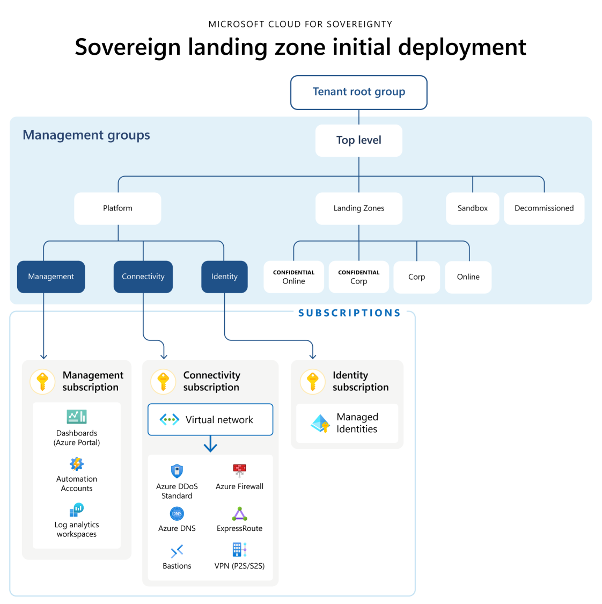

<!-- markdownlint-disable first-line-h1 -->
The `microsoft_cloud_for_sovereignty` starter module provides full customization of the Sovereign Landing Zone using the `inputs.yaml` file. The `inputs.yaml` file provides the ability to enable and disable modules, configure module inputs and outputs, and configure module resources.
A custom `inputs.yaml` file can be passed to the `inputConfigFilePath` argument of the ALZ PowerShell Module. This allows you to firstly design your Azure Landing Zone, and then deploy it.

The default `inputs.yaml` file will need to be modified based off the documentation found [here][parameter_description_powershell_inputs_local_terraform_slz].

Default input files can be found here:

- [inputs-local-terraform-slz.yaml][example_powershell_inputs_local_terraform_slz]

The following table describes the inputs required for the `microsoft_cloud_for_sovereignty` starter module.

| Input | Placeholder | Description |
| - | -- | --- |
| `default_prefix` | `<prefix>` | Prefix value to append to all resources. |
| `default_location` | `<location>` | This is the Azure region to deploy all SLZ resources into. |
| `allowed_locations` | `<list of locations>` | This is a list of Azure regions all workloads running outside of the Confidential Management Group scopes are allowed to be deployed into. |
| `allowed_locations_for_confidential_computing` | `<list of locations>` | This is a list of Azure regions all workloads running inside of the Confidential Management Group scopes are allowed to be deployed into. |
| `iac` | `terraform` | For public preview, only `"terraform"` is supported. |
| `bootstrap` | `alz_local` | For public preview, only `"alz_local"` is supported. |
| `bootstrap_location` | `<location>` | Use the same value as the `default_location`. As of the current release, it is required but not used. |
| `create_bootstrap_resources_in_azure` | `false` | For public preview, only `false` is supported. |
| `starter` | `false` | For public preview, only `false` is supported. |
| `starter_location` | `<location>` | Use the same value as the `default_location`. As of the current release, it is required but not used. |

Full parameter details can be found [here][parameter_description_powershell_inputs_local_terraform_slz].

## Further details on the Microsoft Cloud for Sovereignty Starter Module

The Terraform-based deployment for the Sovereign Landing Zone (SLZ) provides an Enterprise Scale Landing Zone with equivalent compliance posture equal to that of our [Bicep implementation][bicep_implementation_slz]. There is not currently a migration path between the two implementations, however multiple landing zones can be created with either deployment technology in the same Azure tenant.

### High Level Design

### Terraform Modules

#### `alz-archetypes` and `slz-archetypes`

The `alz-archetypes` and `slz-archetypes` are different from Terraform modules, but are used to deploy the management group hierarchy, policy assignments and management resources including the sovereign baseline policies. For more information on the archetypes, view the [ALZ archetypes](https://github.com/Azure/Azure-Landing-Zones-Library/blob/main/platform/alz/) and the [SLZ archetypes](https://github.com/Azure/Azure-Landing-Zones-Library/blob/main/platform/slz/).

#### `subscription-vending`

The `subscription-vending` module is used to deploy the subscriptions and move them within the right management group scopes. For more information on the module itself see [here](https://github.com/Azure/terraform-azurerm-lz-vending/tree/main/modules/subscription).

#### `hubnetworking`

The `hubnetworking` module is used to deploy the hub VNET, Azure Firewall , Route Tables, and other networking primitives into the connectivity subscription. For more information on the module itself see [here](https://github.com/Azure/terraform-azurerm-avm-ptn-hubnetworking).

#### `private-link`

The `private-link` module is used to deploy default private link private DNS Zones. For more information on the module itself see [here](https://github.com/Azure/terraform-azurerm-avm-ptn-network-private-link-private-dns-zones).

#### `alz-management`

The `alz-management` module is used to deploy a set of management resources such as those for centralized logging. For more information on the module itself see [here](https://github.com/Azure/terraform-azurerm-avm-ptn-alz-management).

#### `resource-group`

The `resource-group` module is used to deploy a variety of resource groups within the default subscriptions. For more information on the module itself see [here](https://github.com/Azure/terraform-azurerm-avm-res-resources-resourcegroup).

#### `portal-dashboard`

The `portal-dashboard` module is used to deploy the default compliance dashboard. For more information on the module itself see [here](https://github.com/Azure/terraform-azurerm-avm-res-portal-dashboard).

#### `azure-bastion`

The `azure-bastion` module is used to deploy Azure Bastion for remote access. For more information on the module itself see [here](https://github.com/Azure/terraform-azurerm-avm-res-network-bastionhost).

#### `firewall-policy`

The `firewall-policy` module is used to deploy a default Azure Firewall Policy for further configuration. For more information on the module itself see [here](https://github.com/Azure/terraform-azurerm-avm-res-network-firewallpolicy).

#### `ddos-protection`

The `ddos-protection` module is used to deploy a Standard SKU DDoS Protection Plan resource for network security. For more information on the module itself see [here](https://github.com/Azure/terraform-azurerm-avm-res-network-ddosprotectionplan).

#### `public-ip`

The `public-ip` module is used to deploy a Azure Public IP resoures for offerings that need inbound public internet access such as the VPN and ExpressRoute Gateways. For more information on the module itself see [here](https://github.com/Azure/terraform-azurerm-avm-res-network-publicipaddress).

#### `networksecuritygroup`

The `networksecuritygroup` module is used to deploy a default NSG for the Azure Bastion subnet to restrict ingress and egress network access. For more information on the module itself see [here](https://github.com/Azure/terraform-azurerm-avm-res-network-networksecuritygroup).

 [//]: # (************************)
 [//]: # (INSERT LINK LABELS BELOW)
 [//]: # (************************)

[example_powershell_inputs_local_terraform_slz]:               examples/powershell-inputs/inputs-local-terraform-slz.yaml "Example - PowerShell Inputs - Local - Terraform - SLZ"
[parameter_description_powershell_inputs_local_terraform_slz]: https://aka.ms/slz/terraform/params "Parameter Description - PowerShell Inputs - Local - Terraform - SLZ"
[bicep_implementation_slz]:                                    https://aka.ms/slz/bicep "Sovereign Landing Zone (Bicep)"
